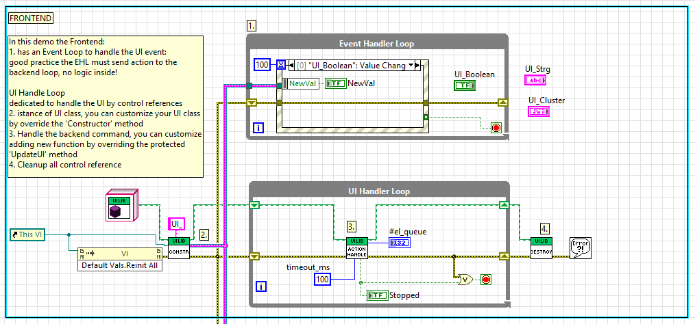

📘 UILibrary – LabVIEW UI Handle Library

UILibrary is a lightweight yet powerful LabVIEW library designed to create a fully decoupled architecture between Backend logic and the User Interface.
It eliminates manual reference handling, avoids boilerplate, and ensures a clean, safe, and maintainable approach for managing UI updates.

🚀 Key Features

-Complete decoupling between Backend logic and UI layer
-Automatic UI control reference management
-Dedicated UI update loop for maximum responsiveness
-No boilerplate, no coupling, full flexibility
-Clean and maintainable UI interaction patterns
-Ideal for modular, scalable, or plugin-based architectures

📋 Prerequisites
To use this library, you need:

LabVIEW 2025 Q3
Additional LabVIEW dependencies: - oglib_array 

📝 Description
UILibrary enables a fully decoupled architecture where Backend logic can operate entirely independently from the UI layer.
Thanks to this library, UI interaction becomes:

Cleaner — minimal block diagram clutter
Safer — no more fragile or invalid control references
Easier to maintain — UI code stays isolated from logic

The best part:

The library automatically manages all UI control references—zero boilerplate, zero coupling, maximum flexibility.

A dedicated UI loop keeps the interface continuously updated by reference, ensuring smooth responsiveness without ever slowing down the Backend.

🧪 Example: UI_Example
The repository includes an example named UI_Example, which demonstrates:

How to register UI controls
How Backend code updates the UI without coupling
How the dedicated UI loop ensures responsiveness
How minimal the block diagram becomes with UILibrary

🔧 Block Diagram Integration Snapshot
Below is a visual example of how simple the integration looks inside a block diagram:

📦 Installation

Clone or download the repository
Open the project in LabVIEW 2025 Q3
Ensure required dependencies are available
Open UI_Example to explore how the library works in practice

🤝 Contributing
Contributions, bug reports, or feature suggestions are welcome.
Please open an Issue or submit a Pull Request.

📄 License
This project is licensed under the terms described in the LICENSE file included in the repository.
